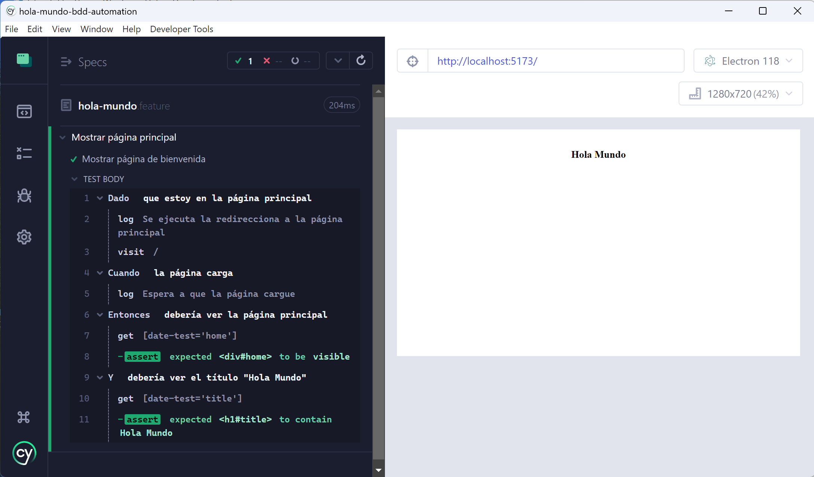

# Hola Mundo BDD Automation
Hola Mundo de una automatización BDD con cypress y cucumber

Node v18.20.3
npx 10.9.2
React ^17.x
typescript
Cypress 13.17.0      


#  Característica Gherkin implementada

```
Característica: Mostrar página principal

  Escenario: Mostrar página de bienvenida
    Dado que estoy en la página principal
    Cuando la página carga
    Entonces debería ver la página principal
    Y debería ver el título "Hola Mundo"
```

#  Instalar
npm install
npx cypress install

#  Ejecutar prueba

Ejecutar en una terminal:
```
npm run dev
```

Ejecutar en otra terminal:
```
npm run test:e2e:open
npm run test:e2e 
```



References: \
https://cucumber.io/docs/gherkin/reference \
https://filiphric.com/cucumber-in-cypress-a-step-by-step-guide#adding-parameters-to-step-definitions

